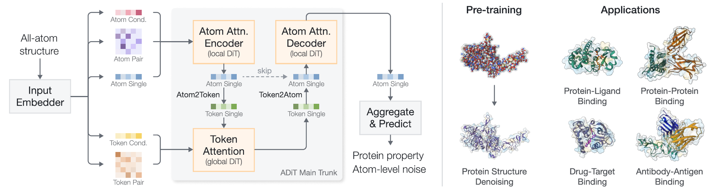

# ADiT
This is the official codebase of the paper

**Towards All-Atom Foundation Models for Biomolecular Binding Affinity Prediction**, *ICLR'2026* 
[[OpenReview](https://openreview.net/forum?id=o0Qfsq1fK8)]

## Overview
Biomolecular interactions play a critical role in biological processes. While recent breakthroughs like AlphaFold 3 have enabled accurate modeling of biomolecular complex structures, predicting binding affinity remains challenging mainly due to limited high-quality data. Recent methods are often specialized for specific types of biomolecular interactions, limiting their generalizability. In this work, we adapt AlphaFold 3 for representation learning to predict binding affinity, a non-trivial task that requires shifting from generative structure prediction to encoding observed geometry, simplifying the heavily conditioned trunk module, and designing a framework to jointly capture sequence and structural information. To address these challenges, we introduce the **<u>A</u>tom-level <u>Di</u>ffusion <u>T</u>ransformer** (**ADiT**), which takes sequence and structure as inputs, employs a unified tokenization scheme, integrates diffusion transformers, and removes dependencies on multiple sequence alignments and templates. We pre-train three ADiT variants on the PDB dataset with a denoising objective and evaluate them across protein-ligand, drug-target, protein-protein, and antibody-antigen interactions. The model achieves state-of-the-art or competitive performance across benchmarks, scales effectively with model size, and successfully identifies wet-lab validated affinity-enhancing antibody mutations, establishing a generalizable framework for biomolecular interactions. 


## Installation
You may install the dependencies via either conda or pip. Below is an example installation via pip for PyTorch 2.1.2 with CUDA 12.1.
```bash
pip install torch==2.1.2 torchvision==0.16.2 torchaudio==2.1.2 --index-url https://download.pytorch.org/whl/cu121
```
The torch_scatter, torch_cluster, torch_sparse, and related packages must be installed according to your specific PyTorch and CUDA version.
For example, for Torch 2.1.0 + CUDA 12.1 + Python 3.10:
```bash
wget https://data.pyg.org/whl/torch-2.1.0%2Bcu121/pyg_lib-0.4.0%2Bpt21cu121-cp310-cp310-linux_x86_64.whl
wget https://data.pyg.org/whl/torch-2.1.0%2Bcu121/torch_scatter-2.1.2%2Bpt21cu121-cp310-cp310-linux_x86_64.whl
wget https://data.pyg.org/whl/torch-2.1.0%2Bcu121/torch_spline_conv-1.2.2%2Bpt21cu121-cp310-cp310-linux_x86_64.whl
wget https://data.pyg.org/whl/torch-2.1.0%2Bcu121/torch_cluster-1.6.2%2Bpt21cu121-cp310-cp310-linux_x86_64.whl
wget https://data.pyg.org/whl/torch-2.1.0%2Bcu121/torch_sparse-0.6.18%2Bpt21cu121-cp310-cp310-linux_x86_64.whl

# Then install them via pip.
```
Install additional dependencies:
```bash
pip install rootutils tqdm biopython foldcomp lightning omegaconf hydra-core pandas dm-tree
pip install rich biotite atom3D torchdrug torcheval spyrmsd lifelines
```

## Checkpoints
The pretrained model checkpoints are available at: `https://huggingface.co/VectorShi/ADiT_pretrained_ckpts`. Please download them and then place them in `./ckpts` directory.

Additionally, please download ESM-2-650M and also place it in `./ckpts` directory.

```bash
./ckpts$ ls
adit_L.ckpt  adit_M.ckpt  adit_S.ckpt  esm2_t33_650M_UR50D.pt
```

## Datasets
The datasets used in this work are available at: `https://huggingface.co/datasets/VectorShi/ADiT_dataset`. 
Steps: 1. Download the datasets. 2. Unzip them. 3. Place all files into the `./dataset` directory.

```bash
./dataset$ ls
5T4  6xc3  adit_pretrain_data  davis  HER2  LBA  skempi
```

After the above steps, execute `python scripts/dump_esm_repr.py` to calculate esm representations for Protein-Protein datasets.

## Reproduction
The following instructions describe how to reproduce the results reported in the ADiT paper using the released pretrained checkpoints.

### Protein-Ligand Binding Affinity
Finetune pretrained checkpoints:
```bash
# identity_30
bash train.sh experiment=lba_S ++trainer.devices=2 ++data.batch_size=16 ++data.dataset.split_identity_threshold=identity_30 ckpt_path=ckpts/adit_S.ckpt

bash train.sh experiment=lba_M ++trainer.devices=4 ++data.batch_size=16 ++data.dataset.split_identity_threshold=identity_30 ckpt_path=ckpts/adit_M.ckpt

bash train.sh experiment=lba_L ++trainer.devices=4 ++data.batch_size=16 ++data.dataset.split_identity_threshold=identity_30 ckpt_path=ckpts/adit_L.ckpt

bash test.sh experiment=lba_L ++trainer.devices=1 ++data.batch_size=1 ++data.dataset.split_identity_threshold=identity_30 ckpt_path="PATH_TO_FINETUNED_CKPT"

# identity_60
bash train.sh experiment=lba_S ++trainer.max_epochs=100 ++trainer.devices=2 ++data.batch_size=16 ++data.dataset.split_identity_threshold=identity_60 ckpt_path=ckpts/adit_S.ckpt

bash train.sh experiment=lba_M ++trainer.max_epochs=100 ++trainer.devices=4 ++data.batch_size=16 ++data.dataset.split_identity_threshold=identity_60 ckpt_path=ckpts/adit_M.ckpt

bash train.sh experiment=lba_L ++trainer.max_epochs=100 ++trainer.devices=4 ++data.batch_size=16 ++data.dataset.split_identity_threshold=identity_60 ckpt_path=ckpts/adit_L.ckpt
```

### Drug-Target Binding Affinity Prediction
Finetuning pretrained checkpoints:
```bash
# split_seed=seed_1
bash train.sh experiment=davis_S ++trainer.devices=2 ++data.batch_size=8 ++data.dataset.split_seed=seed_1 ckpt_path=ckpts/adit_S.ckpt

bash train.sh experiment=davis_M ++trainer.devices=4 ++data.batch_size=8 ++data.dataset.split_seed=seed_1 ckpt_path=ckpts/adit_M.ckpt

bash train.sh experiment=davis_L ++trainer.devices=4 ++data.batch_size=8 ++data.dataset.split_seed=seed_1 ckpt_path=ckpts/adit_L.ckpt

bash test.sh experiment=davis_L ++trainer.devices=1 ++data.batch_size=1 ++data.dataset.split_seed=seed_1 ckpt_path="PATH_TO_FINETUNED_CKPT"
```

### Protein-Protein Binding Affinity Prediction
Finetuning pretrained checkpoints:
```bash
# take test_split=split_0 as an example
bash train.sh experiment=skempi_S ++data.dataset.test_split=split_0 task_name=skempi_S_split_0 ckpt_path=ckpts/adit_S.ckpt

bash train.sh experiment=skempi_M ++data.dataset.test_split=split_0 task_name=skempi_M_split_0 ckpt_path=ckpts/adit_M.ckpt

bash train.sh experiment=skempi_L ++data.dataset.test_split=split_0 task_name=skempi_L_split_0 ckpt_path=ckpts/adit_L.ckpt

bash test.sh experiment=skempi_L ++trainer.devices=1 ++data.batch_size=1 ++data.dataset.test_split=split_0 ++model.save_file=result_split_0.pkl ckpt_path="PATH_TO_FINETUNED_CKPT"
```
After getting `result_split_0.pkl`, `result_split_1.pkl`, and `result_split_2.pkl`, use `scripts/skempi_metric.py` to calculate the overall metrics.

### Antibody-Antigen Binding Affinity Prediction
Testing finetuned ADiT:
```bash
# take adit_L as an example
bash test.sh experiment=her2_L data=her2 ++trainer.devices=1 ++data.batch_size=1 ++model.save_file=result_her2_L.pkl ckpt_path="PATH_TO_FINETUNED_CKPT"
```

## Citation
If you find this codebase useful in your research, please cite the following paper.

```bibtex
@inproceedings{
    shi2026towards,
    title={Towards All-Atom Foundation Models for Biomolecular Binding Affinity Prediction},
    author={Liang Shi and Zuobai Zhang and Huiyu Cai and Santiago Miret and Zhi Yang and Jian Tang},
    booktitle={The Fourteenth International Conference on Learning Representations},
    year={2026},
    url={https://openreview.net/forum?id=o0Qfsq1fK8}
}
```